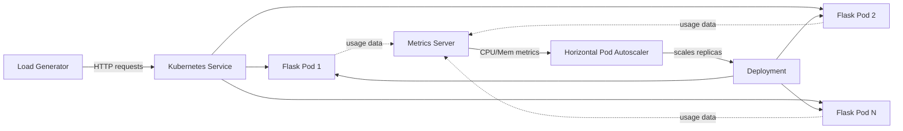

# Autoscale Web Application using Kubernetes HPA

[](https://kubernetes.io/)
[](https://www.docker.com/)
[](https://www.python.org/)
[](https://flask.palletsprojects.com/)
[](LICENSE)

A project demonstrating how to deploy a containerized Flask web application on a Kubernetes cluster and enable automatic pod scaling using the Horizontal Pod Autoscaler (HPA). A load generator is included to simulate traffic and observe autoscaling behavior, performance impact, and scaling accuracy in action.

---

## Table of Contents

- [Overview](#overview)
- [Architecture](#architecture)
- [Prerequisites](#prerequisites)
- [Setup and Deployment](#setup-and-deployment)
- [Observing Autoscaling](#observing-autoscaling)
- [Performance & Scaling Accuracy](#performance--scaling-accuracy)
- [Configuration Reference](#configuration-reference)
- [Troubleshooting](#troubleshooting)
- [Project Structure](#project-structure)
- [Future Enhancements](#future-enhancements)
- [License](#license)

---

## Overview

| Component | Technology |
|---|---|
| Web Framework | Flask (Python) |
| Containerization | Docker |
| Orchestration | Kubernetes |
| Scaling Strategy | Horizontal Pod Autoscaler (CPU-based) |
| Monitoring | Kubernetes Metrics Server |

---

## Architecture

The system is composed of the following layers:

1. **Flask Application** — A lightweight web server that responds to incoming HTTP requests.
2. **Docker Image** — The Flask app is packaged into a container image for portability and consistency.
3. **Kubernetes Deployment** — Manages multiple replicas of the containerized application.
4. **Service** — Exposes the application within the cluster or externally via a stable endpoint.
5. **Metrics Server** — Collects real-time CPU and memory metrics from running pods.
6. **Horizontal Pod Autoscaler (HPA)** — Monitors CPU utilization and adjusts the number of pod replicas accordingly.
7. **Load Generator** — Simulates concurrent HTTP traffic to trigger and observe scaling events.



---

## Prerequisites

Ensure the following are available before proceeding:

- A running Kubernetes cluster (Minikube, Kind, GKE, EKS, or AKS)
- `kubectl` CLI configured to access your cluster
- Metrics Server installed and running in the cluster
- Docker installed for building the container image

---

## Setup and Deployment

### 1. Build the Docker Image

```bash
docker build -t flask-hpa-app:latest .
```

If using Minikube, point your shell to the Minikube Docker daemon first:

```bash
eval $(minikube docker-env)
```

### 2. Deploy the Application

Apply the Kubernetes deployment and service manifests:

```bash
kubectl apply -f k8s/deployment.yaml
kubectl apply -f k8s/service.yaml
```

### 3. Verify the Deployment

```bash
kubectl get pods
kubectl get svc
```

### 4. Install the Metrics Server (if not already present)

```bash
kubectl apply -f https://github.com/kubernetes-sigs/metrics-server/releases/latest/download/components.yaml
```

Verify it is running:

```bash
kubectl get deployment metrics-server -n kube-system
```

### 5. Create the Horizontal Pod Autoscaler

```bash
kubectl apply -f k8s/hpa.yaml
```

Or create it imperatively:

```bash
kubectl autoscale deployment flask-app \
  --cpu-percent=50 \
  --min=1 \
  --max=10
```

Check HPA status:

```bash
kubectl get hpa
```

### 6. Run the Load Generator

```bash
kubectl apply -f k8s/load-generator.yaml
```

This deploys a pod that continuously sends requests to the Flask service, driving up CPU usage and triggering the autoscaler.

---

## Observing Autoscaling

Watch the HPA and pod count in real time:

```bash
kubectl get hpa -w
kubectl get pods -w
```

As CPU utilization rises above the target threshold, Kubernetes will scale up the number of replicas. Once the load generator is stopped and usage drops, the HPA will scale back down after a cooldown period.

---

## Performance & Scaling Accuracy

To validate that the autoscaler behaves as expected, two things are worth tracking during a load test: **how fast it reacts** (performance) and **how closely actual replica count matches the ideal replica count** (accuracy).

### Measuring performance

| Metric | How to capture it |
|---|---|
| Scale-up latency | Time between CPU crossing the threshold and a new pod reaching `Running` |
| Scale-down latency | Time between load stopping and replica count returning to `minReplicas` (subject to the default 5-minute stabilization window) |
| Request latency under load | `kubectl exec` into the load generator or use `hey` / `ab` to log p50/p95/p99 response times |
| Pod startup time | `kubectl get pods --field-selector=status.phase=Running -o wide` timestamps vs. scheduling time |

A simple way to log this during a test run:

```bash
kubectl get hpa flask-app --watch -o custom-columns=\
TIME:.metadata.creationTimestamp,REPLICAS:.status.currentReplicas,CPU:.status.currentCPUUtilizationPercentage
```

### Measuring scaling accuracy

HPA computes the desired replica count using:

```
desiredReplicas = ceil(currentReplicas × (currentCPUUtilization / targetCPUUtilization))
```

You can sanity-check the controller's decisions by comparing the formula's output against what `kubectl get hpa` actually reports at each interval. Logging this over a test run lets you plot **expected vs. actual replicas** to confirm the autoscaler is tracking the formula correctly (it should, barring scaling limits or stabilization windows).

### Example observed run

> Sample data from a local test (Minikube, 2 vCPU node, `targetCPUUtilizationPercentage: 50`, `minReplicas: 1`, `maxReplicas: 10`). Replace with your own numbers once you run a test — actual results depend on cluster size, resource requests, and load profile.

| Time (s) | Load (req/s) | CPU Utilization | Replicas |
|---|---|---|---|
| 0 | 0 | 8% | 1 |
| 30 | 50 | 64% | 1 → 2 |
| 60 | 50 | 58% | 2 |
| 90 | 100 | 71% | 2 → 3 |
| 150 | 0 (load stopped) | 12% | 3 |
| 450 | 0 | 4% | 3 → 1 |

**Observations:**
- Scale-up reacted within one HPA sync interval (default: 15s) of CPU crossing the 50% target.
- Scale-down only occurred after the default 5-minute stabilization window, which prevents flapping.
- Replica count tracked the `ceil(currentCPU / targetCPU)` formula within the `min`/`max` bounds.

---

## Configuration Reference

### HPA Parameters

| Parameter | Description | Default |
|---|---|---|
| `minReplicas` | Minimum number of pods | 1 |
| `maxReplicas` | Maximum number of pods | 10 |
| `targetCPUUtilizationPercentage` | CPU threshold to trigger scaling | 50% |

### Resource Requests (deployment.yaml)

HPA requires resource requests to be defined on the container. Example:

```yaml
resources:
  requests:
    cpu: "100m"
  limits:
    cpu: "200m"
```

---

## Troubleshooting

| Symptom | Likely Cause | Fix |
|---|---|---|
| `kubectl get hpa` shows `<unknown>` for CPU | Metrics Server not installed or not ready | Re-check Metrics Server pod status; on Minikube run `minikube addons enable metrics-server` |
| HPA never scales up | No `resources.requests.cpu` set on the container | Add CPU requests to `deployment.yaml` — HPA can't compute % utilization without them |
| Pods scale up but app stays slow | Cold-start latency, no readiness probe | Add a `readinessProbe` so traffic only hits pods once they're actually ready |
| Scale-down doesn't happen | Stabilization window still active | Default is 5 minutes; wait it out or tune `behavior.scaleDown.stabilizationWindowSeconds` |
| Load generator has no effect | Service DNS/name mismatch | Confirm the load generator targets the correct Service name/port |

---

## Project Structure

```
.
├── app/
│   ├── app.py              # Flask application
│   └── requirements.txt    # Python dependencies
├── Dockerfile              # Container image definition
├── k8s/
│   ├── deployment.yaml     # Kubernetes Deployment
│   ├── service.yaml        # Kubernetes Service
│   ├── hpa.yaml            # Horizontal Pod Autoscaler
│   └── load-generator.yaml # Load generator pod
└── README.md
```

---

## Future Enhancements

- Add custom-metrics-based scaling (e.g., requests-per-second via Prometheus Adapter) instead of CPU-only.
- Integrate Vertical Pod Autoscaler (VPA) alongside HPA for right-sizing requests/limits.
- Add a Grafana + Prometheus dashboard for live visualization of replica count, CPU%, and request latency.
- Automate the example test run above into a CI script that outputs a results table.
- Add a Helm chart for one-command deployment.

---

## License

This project is licensed under the MIT License — see the [LICENSE](LICENSE) file for details.
